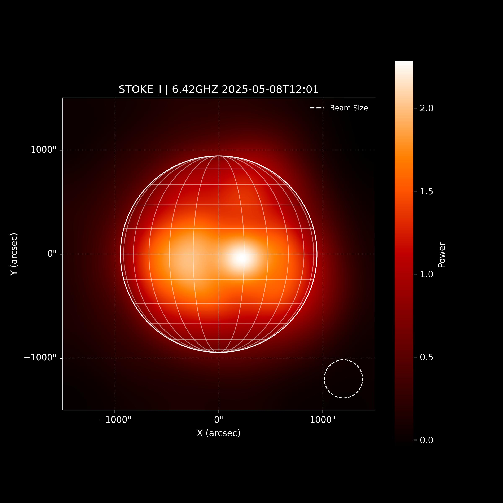

# Imaging of multidimensional spectropolarimetric maps of the Sun obtained by Irbene radio astronomical observations.

The objective of the work is to develop open source tool, which is based on Python
astronomical libraries, to produce 1D, 2D and 3D maps of Sun. Imaging will be based on regular
microwave solar observations conducted by VIRAC on radio telescope RT-32. For the
construction of Stokes I and Stokes V maps the spatial scanning procedure of the solar disk in
the screen plane is used. The series of observations were obtained with the solar spectral
polarimeter (Low Noise Spectral Polarimeter ver. 4 –LNSP4) hardware set. The scanning
procedure was represented by the spiral movement of the antenna beam around the calculated
solar disk centre. Further the maps are constructed after recalculations of observed samples from
a time-antenna position domain to the screen plane by the regularization with bilinear or
modified Richardson-Lucy (MLM) methods.

## Key Functionalities

- Processes data from the VIRAC instrument on the RT-32 radio telescope.
- Constructs Stokes I and Stokes V maps using spatial scanning procedures for the solar disk.
- Employs bilinear and modified Richardson-Lucy (MLM) regularization methods for map reconstruction.
- Offers a user-friendly interface through the `Main.ipynb` Jupyter Notebook.

---

---

Made by Endika Aguirre 2024
