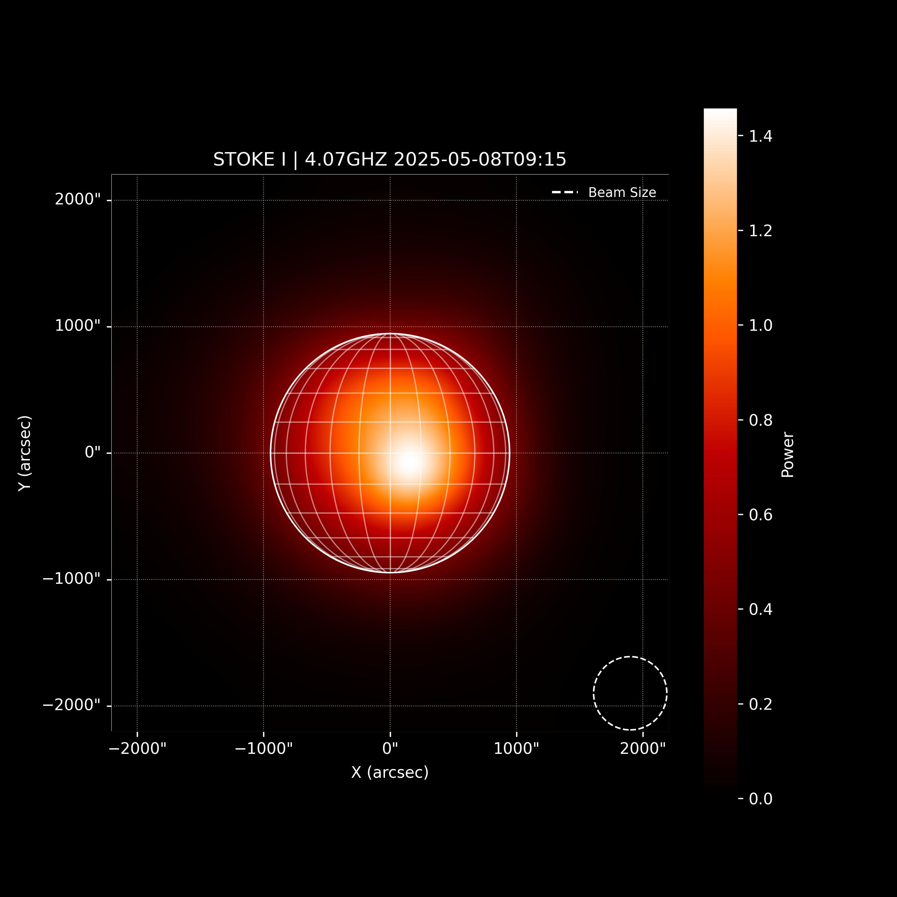
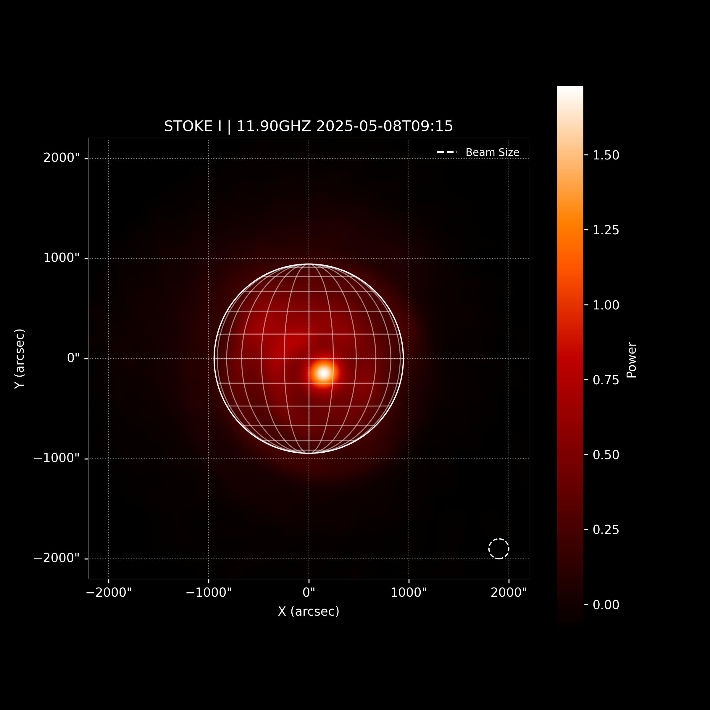
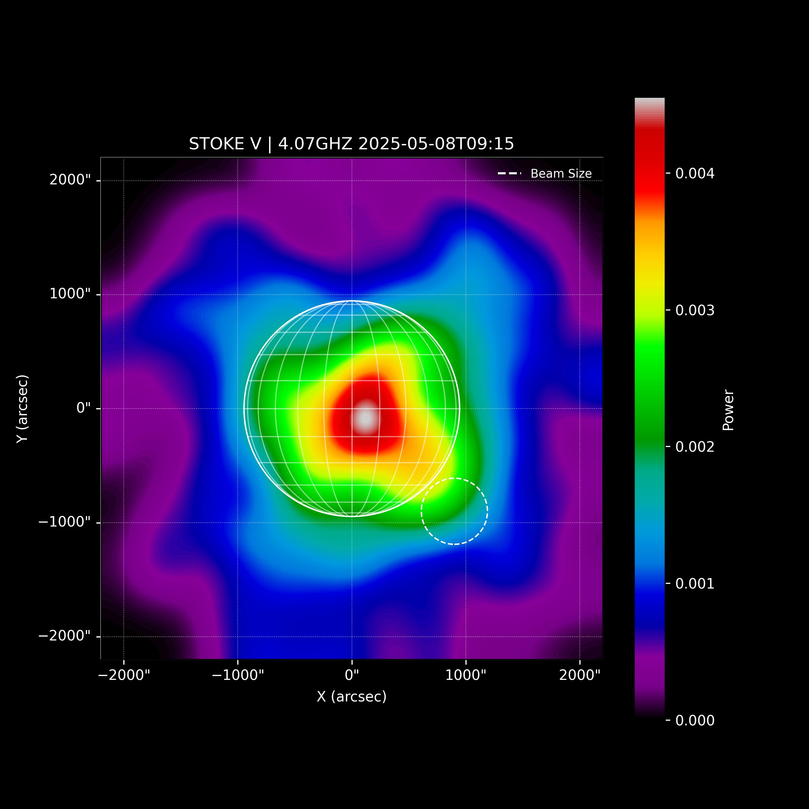
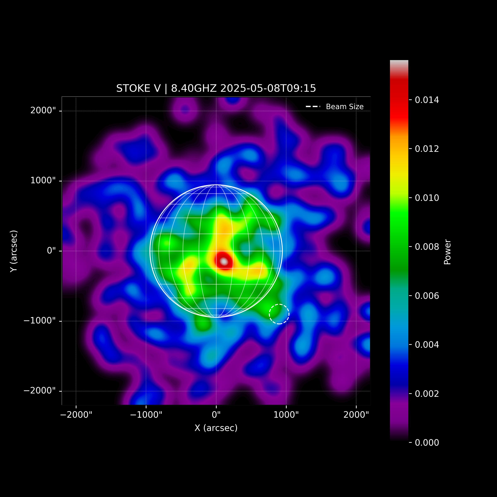
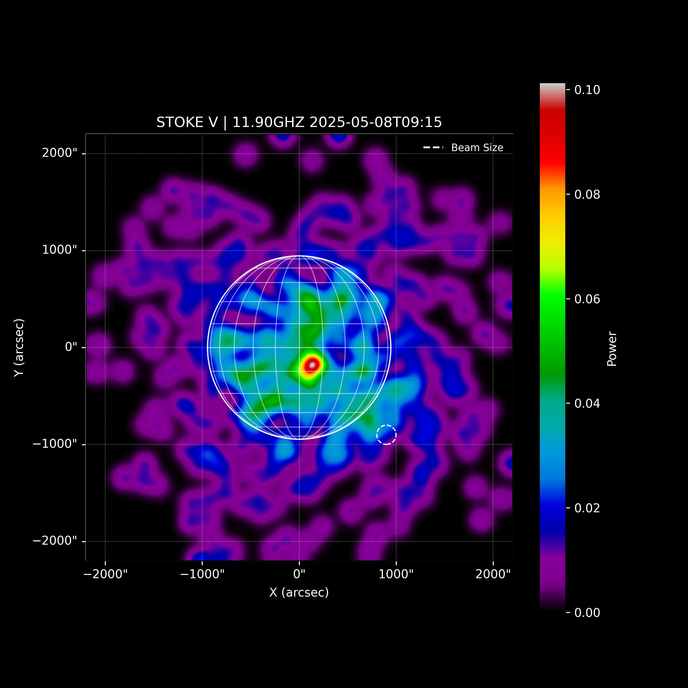
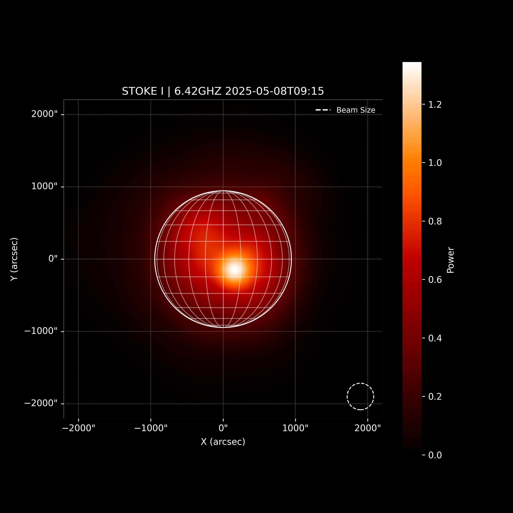
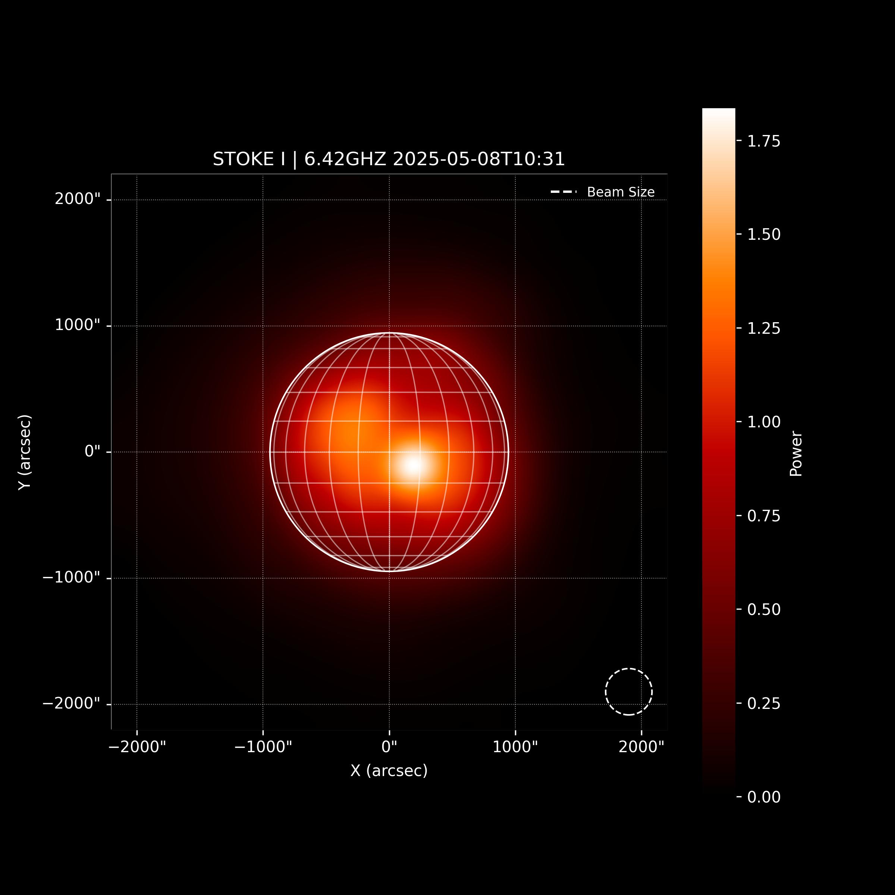
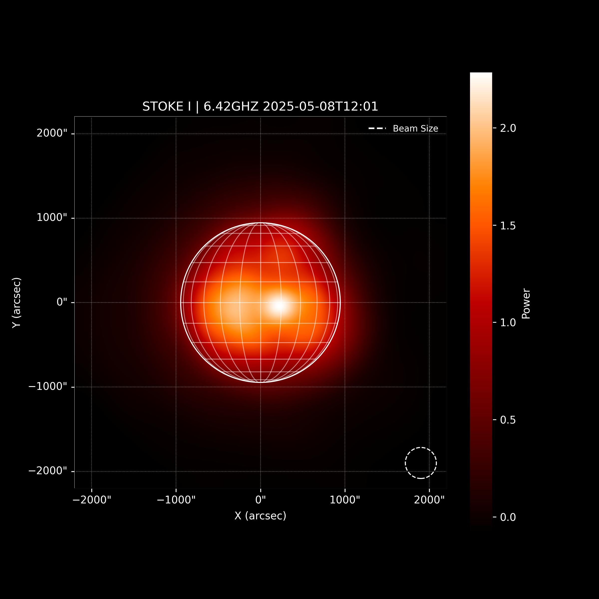

# Imaging of multidimensional spectropolarimetric maps of the Sun obtained by Irbene radio astronomical observations.

The objective of the work is to develop open source tool, which is based on Python
astronomical libraries, to produce 1D, 2D and 3D maps of Sun. Imaging will be based on regular
microwave solar observations conducted by VIRAC on radio telescope RT-32. For the
construction of Stokes I and Stokes V maps the spatial scanning procedure of the solar disk in
the screen plane is used. The series of observations were obtained with the solar spectral
polarimeter (Low Noise Spectral Polarimeter ver. 4 –LNSP4) hardware set. The scanning
procedure was represented by the spiral movement of the antenna beam around the calculated
solar disk centre. Further the maps are constructed after recalculations of observed samples from
a time-antenna position domain to the screen plane.

## Key Functionalities

- Processes data from the VIRAC instrument on the RT-32 radio telescope.
- Constructs Stokes I and Stokes V maps using spatial scanning procedures for the solar disk.
- Offers a user-friendly interface through the `Main.ipynb` Jupyter Notebook.

## Project Structure

The project is organized into the following directories:

### Core Files

- `main.py` - Main script for processing solar observation data
- `main.ipynb` - Interactive Jupyter notebook interface for data analysis
- `testing.ipynb` - Development and testing notebook
- `requirements.txt` - Python dependencies

### Library (`lib/`)

Contains the core processing modules:

- `data_processor.py` - Main data processing and map generation functionality
- `solar_plotter.py` - Visualization and plotting utilities for solar maps
- `spiral_sun_observation.py` - Handles spiral scanning pattern calculations
- `antenna.py` - Antenna position and beam calculations
- `position_generator.py` - Generates coordinate systems for map reconstruction
- `observation_config.py` - Configuration management for observations
- `weather.py` - Weather data integration
- `file_generator.py` - File I/O operations
- `utils.py` - General utility functions

### Data (`data/`)

- `examples/` - Sample data files for testing and demonstration
  - `FITS/` - FITS format observation files from LNSP4 spectropolarimeter
  - `IMAGES/` - Generated output images organized by observation time
  - `PTF/` - Position tracking files (.ptf) containing antenna movement data

## How It Works

1. **Data Input**: The system processes observation data from three main sources:

   - FITS files containing spectropolarimetric measurements
   - PTF files with antenna position tracking data
   - Configuration parameters for the observation setup

2. **Processing Pipeline**:

   - Loads and parses FITS files containing Stokes I and V measurements
   - Reads antenna position data from PTF files
   - Applies coordinate transformations from antenna positions to solar coordinates
   - Performs regularization using bilinear interpolation or Richardson-Lucy methods

3. **Map Generation**: Creates 1D, 2D, and 3D maps of solar brightness and polarization
4. **Visualization**: Generates publication-ready plots and images saved to the output directories

## Example Results

### Solar Maps at Different Frequencies

#### Stokes I (Intensity) Maps

<table>
<tr>
<td align="center">

<br><b>4.07 GHz</b>
</td>
<td align="center">

<br><b>8.40 GHz</b>
</td>
<td align="center">

<br><b>11.90 GHz</b>
</td>
</tr>
</table>

#### Stokes V (Circular Polarization) Maps

<table>
<tr>
<td align="center">

<br><b>4.07 GHz</b>
</td>
<td align="center">

<br><b>8.40 GHz</b>
</td>
<td align="center">

<br><b>11.90 GHz</b>
</td>
</tr>
</table>

### Time Series Comparison

<table>
<tr>
<td align="center">

<br><b>09:15 UT</b>
</td>
<td align="center">

<br><b>10:31 UT</b>
</td>
<td align="center">

<br><b>12:01 UT</b>
</td>
</tr>
<tr>
<td colspan="3" align="center"><b>Solar Evolution at 6.42 GHz (Stokes I) - May 8, 2025</b></td>
</tr>
</table>

---

## Citations

```bibtex
@article{article,
author = {Bezrukov, D.},
year = {2017},
month = {02},
pages = {9-14},
title = {Spectral Polarimetric Observations of the Sun by the VIRAC RT-32 Radio Telescope: First Results},
volume = {22},
journal = {Baltic Astronomy},
doi = {10.1515/astro-2017-0142}
}
```

**Reference:** Bezrukov, D. (2017). Spectral Polarimetric Observations of the Sun by the VIRAC RT-32 Radio Telescope: First Results. _Baltic Astronomy_, 22, 9-14. DOI: [10.1515/astro-2017-0142](https://doi.org/10.1515/astro-2017-0142)

---

Made by Endika Aguirre 2024
